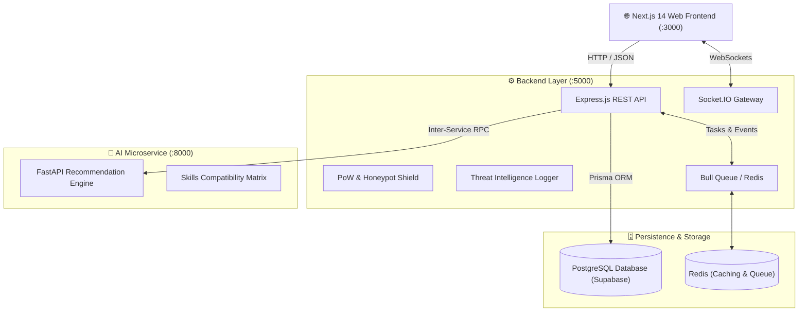

# 🏛️ System Architecture & Design

The **Innovation Collaboration Hub** is engineered as a decoupled microservices architecture designed for real-time collaboration, security monitoring, and matchmaking.

---

## 🏗️ High-Level System Architecture

---

## 📦 Component Breakdown

### 1. Frontend (`frontend/`)
- **Framework**: Next.js 14 App Router (React 18)
- **Styling**: Tailwind CSS & Glassmorphic Custom Design Tokens (`globals.css`)
- **State Management**: Zustand stores (`authStore.ts`, `socketStore.ts`)
- **Real-Time**: Socket.IO client for messaging, live notifications, and traffic telemetry

### 2. Backend (`backend/`)
- **Runtime**: Node.js + TypeScript (Express)
- **ORM & Data Layer**: Prisma ORM with PostgreSQL
- **Security Interceptors**: Helmet, CORS, JWT authentication, Honeypot detection, SHA-256 Proof-of-Work verifier
- **Worker Queues**: Bull queues backed by Redis for asynchronous notifications and stats aggregation

### 3. AI Service (`ai-service/`)
- **Runtime**: Python 3.10+ (FastAPI, Uvicorn)
- **Purpose**: Provides skill similarity computations, student matchmaking recommendations, and team compatibility scores

---

## 🗃️ Core Data Models (Prisma)

- **`User`**: Profiles, credentials, department roles (`admin`, `student`, `moderator`), badges, and portfolio links.
- **`Project`**: Student initiatives, hackathon projects, tags, and required squad roles.
- **`Commit`**: Granular commit telemetry (hash, message, additions, deletions, filesChanged) for developer rankings.
- **`ThreatLog`**: Security incidents, brute-force detections, honeypot traps, client fingerprints, and severity levels.
- **`Message` & `Notification`**: Real-time communication and campus broadcast records.
