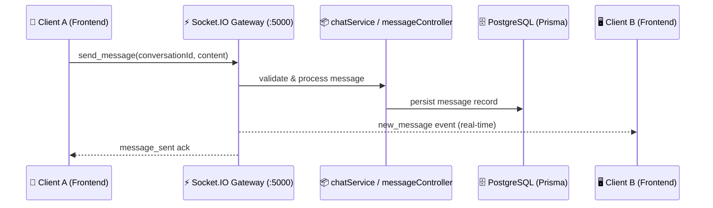

# 💬 Real-Time Chat & Notification System

The **Innovation Collaboration Hub** features instant peer-to-peer messaging, squad channels, and campus-wide notifications powered by **Socket.IO**, **Express**, and **Bull queue**.

---

## 🏗️ Real-Time Architecture

---

## 🔔 Notification Center

The Notification Center dispatches real-time alerts for:
- 🤝 **Team Invitations & Join Requests**: Instant alerts when requested to join a project squad.
- 💬 **Direct Messages & Mentions**: Unread message badges and sound cues.
- 🛡️ **Security Alerts**: Critical alerts sent to admins upon threat detection.
- 🏆 **Milestones & Achievements**: Notifications when climbing the contributor leaderboard or earning quiz badges.

---

## 🔌 Socket.IO Events

| Event Name | Direction | Payload Description |
| :--- | :--- | :--- |
| `join_room` | Client -> Server | Join a project or private chat channel room |
| `leave_room` | Client -> Server | Leave a specific chat channel room |
| `send_message` | Client -> Server | Message payload (`conversationId`, `content`, `receiverId`) |
| `receive_message`| Server -> Client | Broadcasted message payload with timestamp |
| `user_typing` | Bidirectional | Live typing status indicator |
| `notification` | Server -> Client | System / broadcast notification dispatch |

---

## 📡 REST API Endpoints

| Endpoint | Method | Description |
| :--- | :--- | :--- |
| `/api/chat/conversations` | `GET` | List active user conversations |
| `/api/chat/messages/:id` | `GET` | Fetch paginated chat history for a conversation |
| `/api/chat/messages` | `POST` | Send a new message (fallback if WebSocket disconnected) |
| `/api/notifications` | `GET` | Fetch unread notifications for current user |
| `/api/notifications/read` | `PUT` | Mark notification as read |
