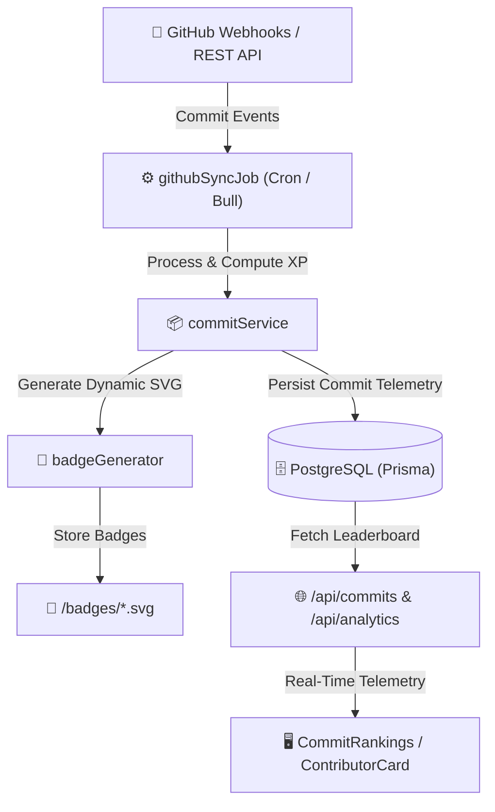

# 📊 Commit & Contribution Tracking Engine

The **Innovation Collaboration Hub** features a comprehensive commit telemetry and contributor ranking engine that tracks GitHub contributions across projects and departments in real-time.

---

## 🏗️ Architecture & Pipeline



---

## 🚀 Key Features

### 1. Granular Commit Telemetry
Each commit recorded in the system includes:
- Commit SHA and branch reference
- Author details and linked student profile
- Line additions (`+`), deletions (`-`), and files modified
- Timestamp and commit message

### 2. Contributor Rankings & Leaderboard
- Real-time aggregation of commit activity per user and per team.
- Leaderboard ranking based on XP calculation, contribution frequency, and project milestones.
- Filterable by department (AI, Cybersecurity, IT & Networks, Software Engineering).

### 3. Dynamic Contributor Badges
- SVG badge generation for contributors (`/badges/<username>.svg`).
- Embeddable in student GitHub profiles and portfolios.

---

## 📡 API Endpoints

| Endpoint | Method | Description |
| :--- | :--- | :--- |
| `/api/commits` | `GET` | Retrieve latest recorded commits across projects |
| `/api/commits/rankings` | `GET` | Fetch real-time contributor rankings and leaderboard stats |
| `/api/commits/user/:userId` | `GET` | Get detailed commit breakdown for a specific user |
| `/api/commits/sync` | `POST` | Trigger manual GitHub repository sync (Admin only) |

---

## ⚙️ Configuration

Ensure the following environment variables are configured in `backend/.env`:

```env
# GitHub Integration (Optional for extended API rate limits)
GITHUB_API_TOKEN="your_github_personal_access_token"
```
