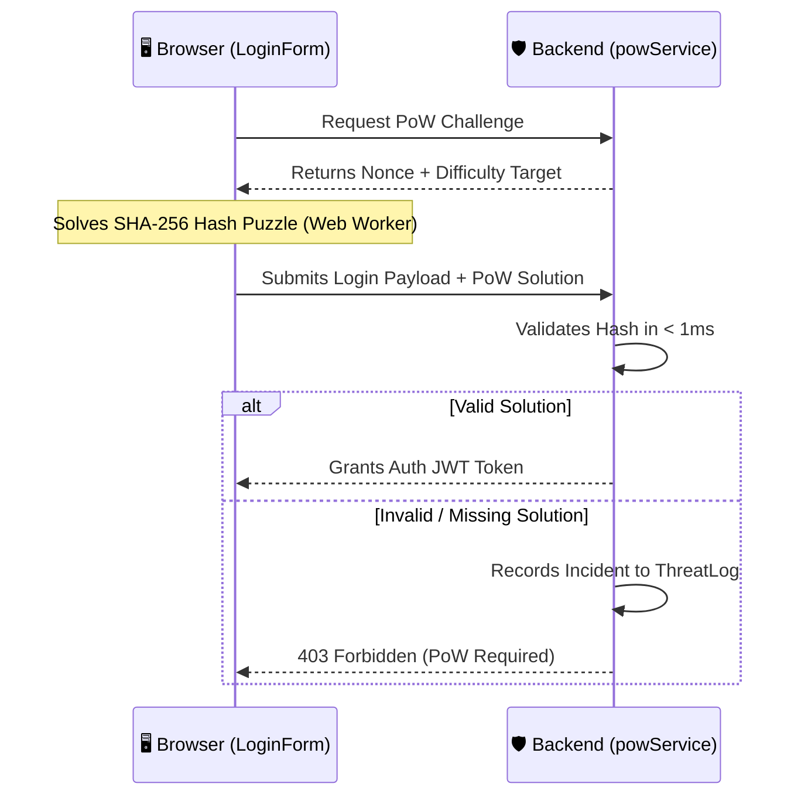

# 🛡️ Cybersecurity & SOC Threat Intelligence

The platform incorporates active defense mechanisms designed and implemented by the **Cybersecurity Team** to safeguard campus authentication routes and monitor live malicious traffic.

---

## 🔒 1. Cryptographic Proof-of-Work (PoW) Shield

To defeat automated credential-stuffing bots and distributed brute-force attacks on `/api/auth/login`, the application utilizes a client-side Proof-of-Work challenge:

- **Frontend Client**: [frontend/lib/security/pow.ts](file:///c:/Users/HP/Documents/GitHub/Innovation-Collaboration-Hub-/frontend/lib/security/pow.ts)
- **Backend Verifier**: [backend/src/security/powService.ts](file:///c:/Users/HP/Documents/GitHub/Innovation-Collaboration-Hub-/backend/src/security/powService.ts)

---

## 🍯 2. Honeypot Field Interception

Login and registration forms contain hidden honeypot fields invisible to legitimate human users. Automated web scrapers and bot scripts filling all input fields trigger immediate interception and IP threat logging.

---

## 📊 3. SOC Real-Time Threat Audit Feed

All security incidents are persisted to the database and streamed to the Admin Dashboard:

| Severity | Color Code | Description | Example Trigger |
| :--- | :--- | :--- | :--- |
| **`CRITICAL`** | 🔴 Red | High-risk automated intrusion attempt | Honeypot trap triggered, SQLi pattern detected |
| **`HIGH`** | 🟠 Orange | Repeated failed authentication threshold | Brute-force password guessing |
| **`AMBER`** | 🟡 Yellow | Anomaly / Missing verification | PoW challenge validation failed, expired nonce |

### Accessing the Security Audit Dashboard
1. Log in with an **`admin`** role account.
2. Navigate to **`/admin`**.
3. Select the **`Security Audit & Threat Logs`** tab.
4. Click **`Simulate Threat Event`** to run threat simulation tests.
